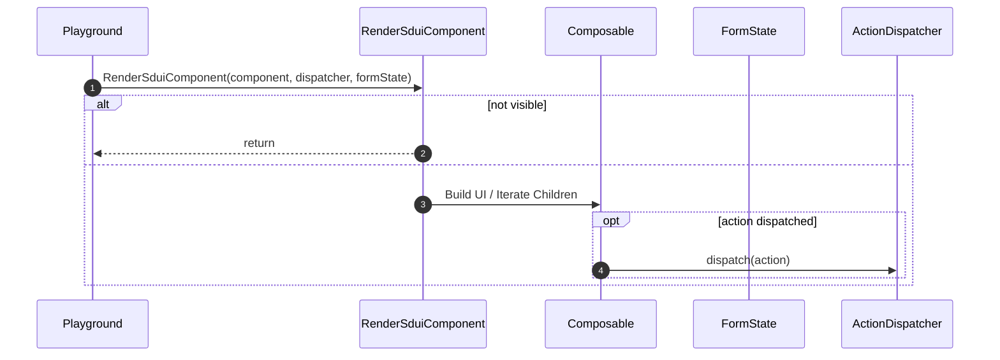

# SDUI.kt – DroidKaigi 2025: Server Driven UI in Kotlin Multiplatform

> **⚠️ This repository is a presentation/demo codebase, not a reusable library. It is designed for educational and experimental purposes only. There are no plans to maintain or develop it as a general-purpose SDUI library. Feel free to explore, learn, and experiment, but do not use this as a dependency in production apps.**

---

## 🎤 Presentation Goals

- **Demystify SDUI**: Show what "server-driven UI" means in practice for mobile and cross-platform apps.
- **Highlight Tradeoffs**: Reveal the choices, challenges, and implementation details you’ll face building SDUI systems.
- **Hands-on Understanding**: Let you observe, edit, and break SDUI examples live, so you can internalize the patterns, pitfalls, and power of this approach.
- **Inspire Experimentation**: Provide you with a practical foundation to apply these techniques in your own projects.

---

## 🧑‍💻 How This Repository Supports the Talk

- **Live Playground**: Try real SDUI JSON, see instant preview updates, and experiment with validation and fallback mechanisms.
- **Modular Demo Code**: Each concept (parsing, validation, rendering, actions, state) is isolated for clarity and for demonstrating the talk material.
- **Multi-platform Ready**: Demos run on Android, Desktop, iOS, and Web via Compose Multiplatform—showing how SDUI can unify UI logic across platforms.

---

## 🧩 Key Concepts Demoed

- **Describing UI as JSON**: Author screens and flows in JSON, then decode to a strongly-typed UI tree.
- **Validation First**: Catch errors and bad data before a single pixel is drawn.
- **Composable Rendering**: Map declarative JSON to Kotlin Composables, styles, and modifiers.
- **User Input & Actions**: Handle forms, local state, and action dispatch—all defined in the JSON model.
- **Error Handling & Fallbacks**: Keep the demo (and your app!) resilient to malformed server data.

---

## 🏃‍♂️ Try It Out (for Learning & Experimentation)

- **Run the playground** (see Quick Start below) and try editing the provided example JSONs.
- **Observe the logs**: Watch parsing/validation in action—see what breaks, and why.
- **Follow code links**: Jump straight to the key demo files referenced below.
- **Fork and hack**: Use this as a sandbox for your own SDUI experiments or prototypes.

---

## 🚦 Quick Start

> **No prior SDUI experience required!**

- **Android**: Open project in Android Studio (Giraffe+), run the `composeApp` target.
- **Desktop**: `./gradlew :composeApp:run`
- **Web**: `./gradlew :composeApp:wasmJsBrowserDevelopmentRun`
- **iOS**: Open `iosApp/iosApp.xcodeproj`, run in Xcode.

**Playground Usage:**  
Pick an example, edit JSON, see live results. On error, the preview falls back to the last working state so you can iterate rapidly—just like in the talk!

---

## 🗂️ Demo Structure

- **composeApp**: The live playground, multiplatform entrypoints, and example JSONs.
- **sdui**: SDUI model, parsing, validation, rendering, style mapping, actions, and state.

### Key Demo Files

- `SduiPlaygroundScreen.kt`: Orchestrates example selection, parsing, preview, and fallback.
- `SduiComponent.kt`: Core UI tree model.
- `SduiSerializer.kt` & `SduiValidator.kt`: Parse and validate SDUI JSON.
- `Renderer.kt`: Maps model to composables and styles.
- `ActionDispatcher.kt` & `DefaultActionDispatcher.kt`: Demo action handling (navigation, API, dialogs, etc).

---

## 🔎 Example JSON (from the Talk!)

```json
{
  "type": "column",
  "children": [
    { "type": "text", "text": "Hello SDUI", "style": { "fontSize": 20, "textColor": "#222222" } },
    { "type": "button", "text": "Continue", "action": { "type": "navigate", "payload": { "route": "next" } } }
  ],
  "style": { "padding": { "all": 16 } }
}
```

---

## 🔬 Under the Hood: Demo Flows

### Rendering Flow



---

## ⚠️ Disclaimer & Scope

- **This is NOT a production library**: This codebase exists solely to support a talk and hands-on learning.
- **No plans for maintenance or general-purpose use**: Breaking changes and incomplete features are likely.
- **Learning, experimenting, and prototyping are encouraged!**
- **Do NOT use as a dependency or expect versioned releases.**

---

## 🙏 Thanks & Credits

- Inspired by the Compose Multiplatform and SDUI communities.
- Questions? Find me after the talk or open an issue!

---

[MIT License](LICENSE)