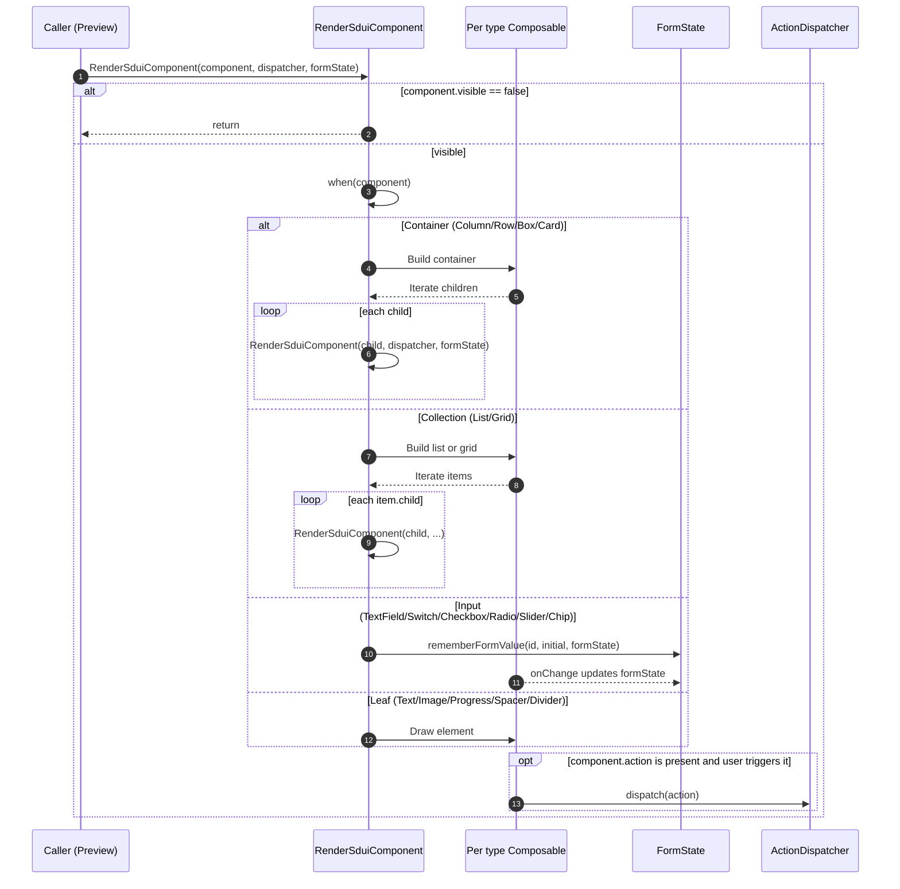
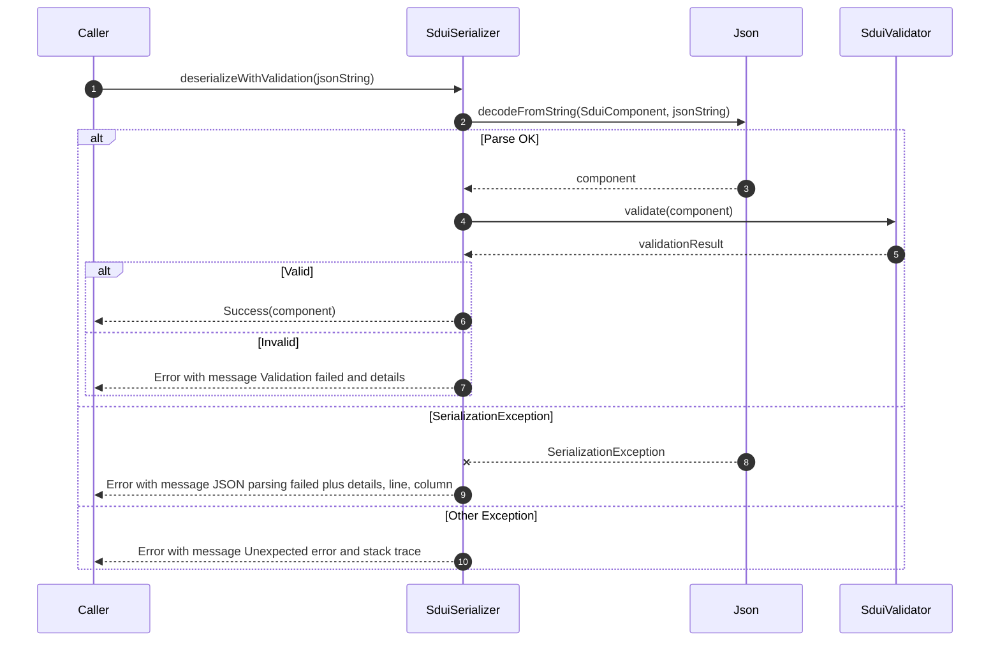

## SDUI Showcase for DroidKaigi 2025

This repository presents a practical walkthrough of Server Driven UI on Kotlin Multiplatform using Compose Multiplatform. It is designed as a talk and demo companion for DroidKaigi 2025. It is not intended to be shipped or evolved as an independent library. All code exists to illustrate ideas, trade offs, and implementation techniques that help an audience reason about SDUI on Android and beyond.

### What this project demonstrates

1. Describing UI as JSON that is decoded into a typed component tree
2. Validating incoming data before use in rendering
3. Rendering the component tree with Compose Multiplatform
4. Mapping high level style to Compose modifiers
5. Capturing user input and local form state
6. Dispatching actions from the JSON model to the host application

### Modules at a glance

1. `composeApp` contains the playground application, preview surfaces, example JSON files, and platform launchers for Android, iOS, Desktop, and Web (Wasm)
2. `sdui` contains the demonstrative SDUI model, serializer, validator, renderer, style mapping, and simple action plumbing used by the playground

### End to end flow

1. JSON is authored in the playground editor or loaded from resources
2. `SduiSerializer.deserializeWithValidation` parses the JSON to `SduiComponent` using kotlinx.serialization
3. `SduiValidator` runs structural and semantic checks and returns issues when present
4. On success the component tree is rendered by `RenderSduiComponent`
5. Each node selects a matching Composable and applies `Modifier.applyStyle`
6. Input components bind to a simple `FormState`; components may include an `action` which is dispatched through an `ActionDispatcher`

### Quick start

Android

1. Open the project in Android Studio (Giraffe or newer)
2. Select the `composeApp` run configuration
3. Run on a device or emulator

Desktop (Compose Desktop)

1. From a terminal run:

```bash
./gradlew :composeApp:run
```

Web (Wasm)

1. From a terminal run:

```bash
./gradlew :composeApp:wasmJsBrowserDevelopmentRun
```

iOS

1. Open `iosApp/iosApp.xcodeproj` in Xcode
2. Select a simulator target and run

### Using the playground

The playground screen lets you select an example, edit the JSON, and see the result in a mobile styled preview. Parsing and validation status is logged in a terminal style panel. When the current JSON cannot be parsed or validated, the preview can fall back to the last working component so you can iterate without losing context.

Key entry points in the playground:

1. `composeApp/src/commonMain/kotlin/com/amnix/sdui/screens/SduiPlaygroundScreen.kt` coordinates example selection, parsing, logging, and fallbacks
2. `composeApp/src/commonMain/kotlin/com/amnix/sdui/components/LayoutComponents.kt` contains the preview layout and renders the component with `RenderSduiComponent`
3. Example JSON lives under `composeApp/src/commonMain/composeResources/files/sdui-examples`

### Core building blocks

Model

1. `sdui/src/commonMain/kotlin/com/amnix/sdui/sdui/components/SduiComponent.kt` defines the sealed hierarchy used to represent the UI tree
2. `sdui/src/commonMain/kotlin/com/amnix/sdui/sdui/model/Style.kt` defines a compact style model that maps onto Compose modifiers

Parsing and validation

1. `sdui/src/commonMain/kotlin/com/amnix/sdui/sdui/SduiSerializer.kt` parses JSON and returns a `SerializationResult`
2. `sdui/src/commonMain/kotlin/com/amnix/sdui/sdui/validation/SduiValidator.kt` validates component trees and reports issues

Rendering

1. `sdui/src/commonMain/kotlin/com/amnix/sdui/sdui/renderer/Renderer.kt` contains `RenderSduiComponent` and the per type Composables
2. `sdui/src/commonMain/kotlin/com/amnix/sdui/sdui/renderer/StyleExtensions.kt` applies `Style` to a Compose `Modifier`
3. `sdui/src/commonMain/kotlin/com/amnix/sdui/sdui/renderer/FormState.kt` provides simple helpers for local input state

Actions and state

1. `sdui/src/commonMain/kotlin/com/amnix/sdui/sdui/model/SduiAction.kt` declares the action types used in examples
2. `sdui/src/commonMain/kotlin/com/amnix/sdui/sdui/renderer/ActionDispatcher.kt` defines a minimal dispatch interface
3. `sdui/src/commonMain/kotlin/com/amnix/sdui/sdui/renderer/DefaultActionDispatcher.kt` shows a more complete dispatcher suitable for demos
4. `sdui/src/commonMain/kotlin/com/amnix/sdui/sdui/renderer/SduiStateManager.kt` demonstrates a small observable state store that can back actions during demos

### Example JSON

```json
{
  "type": "column",
  "children": [
    { "type": "text", "text": "Hello SDUI", "style": { "fontSize": 20, "textColor": "#222222" } },
    { "type": "button", "text": "Continue", "action": { "type": "navigate", "payload": { "route": "next" } } }
  ],
  "style": { "padding": { "all": 16 } }
}
```

### Diagrams

Playground flow

```mermaid
sequenceDiagram
    autonumber
    participant U as User
    participant P as SduiPlaygroundScreen
    participant Ser as SduiSerializer
    participant Val as SduiValidator
    participant RL as ResponsiveLayout
    participant Prev as Preview
    participant R as RenderSduiComponent
    participant AD as Dispatcher
    participant FS as FormState
    participant L as Logs

    U->>P: Select example / Edit JSON
    P->>Ser: deserializeWithValidation(json)
    Ser->>Val: validate(component)
    Val-->>Ser: ValidationResult
    Ser-->>P: SerializationResult (Success or Error)
    alt Success
      P->>P: Save lastWorkingComponent
      P->>RL: Pass parsedComponent Success
      RL->>Prev: Pass component, dispatcher, formState
      Prev->>R: RenderSduiComponent(component, dispatcher, formState)
    else Error
      P->>L: Log error
      alt lastWorkingComponent exists
        P->>RL: Use lastWorkingComponent
        RL->>Prev: Pass fallback component
        Prev->>R: RenderSduiComponent(...)
      else
        P-->>U: Show error; no render
      end
    end

    U->>Prev: Interact with UI
    Prev->>AD: dispatch(action)
    alt Navigate
      AD->>L: Log route or success
    else Reset
      AD->>FS: clearAllFormValues
      AD->>L: Log reset
    else Other
      AD->>L: Log action type
    end
```

RenderSduiComponent flow



SduiSerializer flow



### Scope and expectations

This codebase is tailored to a conference presentation. Names, APIs, and behaviors can change without notice. The focus is clarity for an audience, not long term compatibility. Use it as a learning aid, a reference for your own explorations, or a starting point for prototypes.


